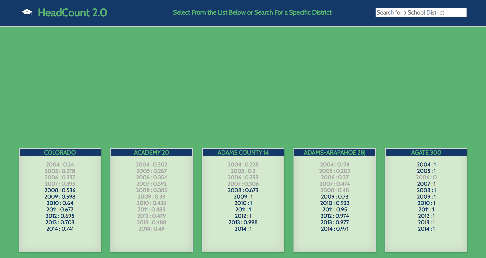
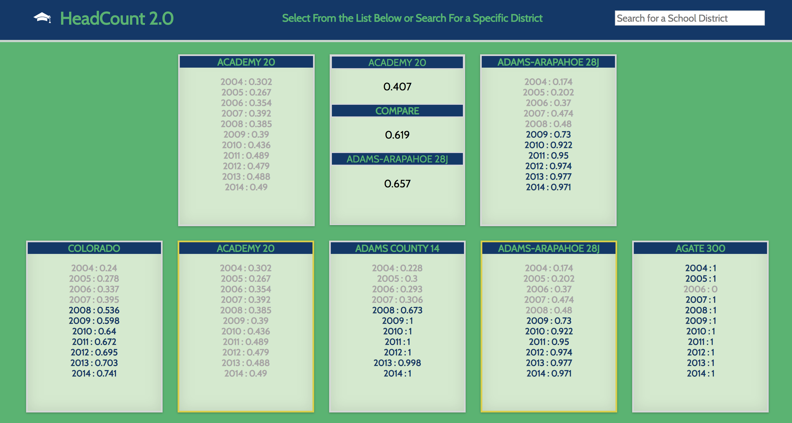

# HeadCount 2.0

HeadCount 2.0 is a project designed to manipulate data and creating small, reusable React components.  The project contains various educational stats from districts within Colorado by year, per district.  

This application is focused on Test Driven Development through the ultilization of Jest and Enzyme. It was initialized using the `create-react-app` boilerplate. Standing issues and further development notes can be found [here](https://waffle.io/TFisch/headcount2.0 "here").

  

  
 
